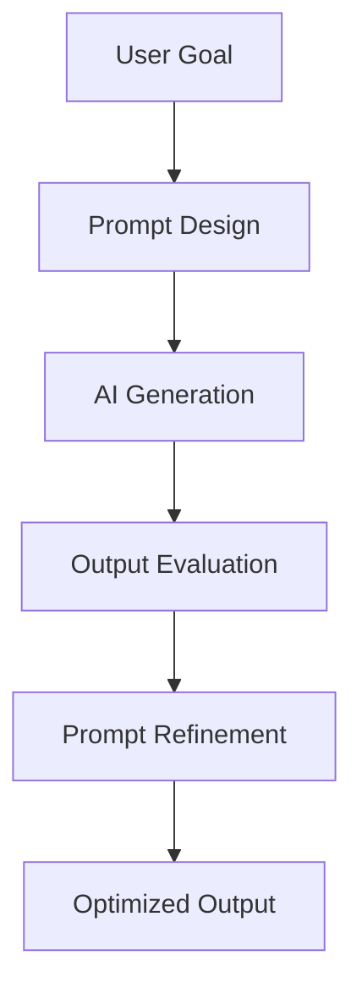
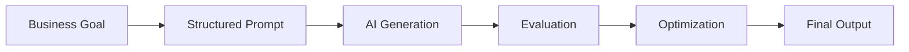
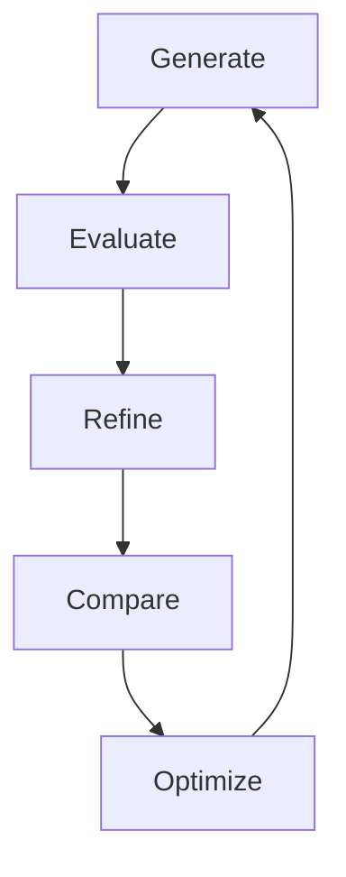

<!-- ===================================================== -->
<!-- BANNER -->
<!-- ===================================================== -->

<p align="center">

</p>

<p align="center">

</p>

---

# 🚀 PromptForge 2.0

### 🧠 AI Prompt Optimization & Evaluation Framework

PromptForge is a **structured prompt engineering framework** designed to improve **AI-generated outputs using systematic optimization workflows.**

---

# 👀 Repository Visitors

<p align="center">

</p>

---

# 📊 GitHub Stats

<p align="center">


</p>

---

# 📚 Table of Contents

- Overview
- Architecture
- Workflow
- Optimization Loop
- Benchmarking
- Framework Modules
- Prompt Templates
- Case Study
- Repository Structure
- Skills Demonstrated
- Target Users
- Author

---

# 🧠 Overview

PromptForge helps transform **basic prompts into optimized AI instructions** that produce **higher-quality outputs**.

Common problems solved:

❌ Generic AI responses  
❌ Weak marketing copy  
❌ Poor SEO structure  
❌ Low conversion content  

PromptForge introduces **prompt iteration and evaluation systems**.

---

# 🏗 Architecture



---

# ⚙️ Optimization Workflow



---

# 🔁 Prompt Optimization Loop



---

# 📊 Prompt Benchmarking

| Prompt Type | Clarity | SEO | Conversion | Overall |
|-------------|--------|------|------------|--------|
| Basic Prompt | 5/10 | 4/10 | 4/10 | 4.3 |
| Structured Prompt | 7/10 | 7/10 | 6/10 | 6.7 |
| PromptForge Optimized | 9/10 | 8/10 | 9/10 | 8.7 |

---

# 🧩 Framework Modules

### 1️⃣ Prompt Structuring

Define:

- Role
- Objective
- Audience
- Constraints
- Tone
- Keywords

Example:

```
Role: Marketing Strategist
Goal: Write a landing page
Audience: Startup founders
Tone: Professional
```

---

### 2️⃣ AI Generation

Execute structured prompts using:

- ChatGPT
- Claude
- Gemini

---

### 3️⃣ Output Evaluation

| Criteria | Description |
|--------|--------|
| Clarity | Message readability |
| Specificity | Detail level |
| Authority | Credibility |
| SEO | Keyword usage |
| Conversion | Persuasive strength |

---

### 4️⃣ Prompt Refinement

Improve outputs using:

- context expansion
- constraint tuning
- tone optimization
- structure improvement

---

# 📚 Prompt Template Library

### Marketing Prompt

```
Role: Digital Marketing Strategist

Objective:
Create a high-converting landing page.

Audience:
Startup founders.

Structure:
Hook
Problem
Solution
Benefits
CTA
```

---

### LinkedIn Post Prompt

```
Role: LinkedIn Growth Strategist

Goal:
Generate a viral LinkedIn post.

Structure:
Hook
Insight
Example
Takeaway
CTA
```

---

# 📊 Case Study

### Basic Prompt

```
Write a post about AI resume builders.
```

Output → Generic content.

---

### Optimized Prompt

```
Role: LinkedIn Marketing Strategist

Goal:
Create a high-engagement LinkedIn post promoting an AI resume builder.

Audience:
College students applying for jobs.

Structure:
Hook
Problem
Solution
CTA
Hashtags
```

Output → Structured persuasive content.

---

# 📂 Repository Structure

```bash
PromptForge-2.0
│
├── landing-page-v1.md
├── landing-page-v2.md
├── landing-page-v3.md
│
├── evaluation-framework.md
├── output-analysis.md
│
└── README.md
```

---

# 🧠 Skills Demonstrated

- Prompt Engineering
- AI Workflow Design
- AI Output Optimization
- Conversion Copywriting
- Technical Documentation

---

# 👥 Target Users

PromptForge is useful for:

- AI Prompt Engineers
- Digital Marketers
- Content Creators
- Startup Founders
- Freelancers

---

# 👨‍💻 Author

**Pranjal Sharma**

AI Prompt Engineering  
Content Strategy  

GitHub  
https://github.com/pranjalsharma14

---

# ⭐ Support

If you like this project:

⭐ Star the repository  
🍴 Fork the repository  
📢 Share it with AI builders
